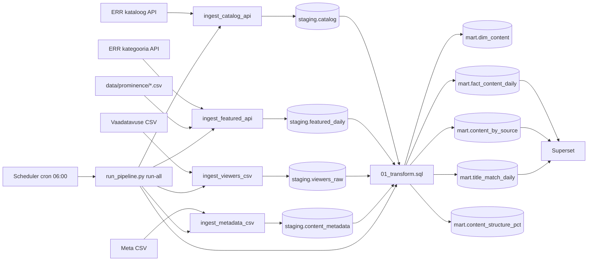

# Arhitektuur

Jupiteri (ERR) sisu andmeanalüüsi projekt. Andmed liiguvad ERR API-st ja CSV-failidest PostgreSQL-i, transformeeritakse `mart` kihti ning visualiseeritakse Supersetis.

## Äriküsimus

1. Kuidas erinevad Jupiteri **kataloogis olemasoleva** sisu, **kasutajaliideses esiletõstetud** sisu ja **vaadatud** sisu struktuurid **sisutüüpide** ja **päritolumaad** lõikes?
2. Kui tugev on **esiletõstetuse** ja **vaadatavuse** vaheline seos?

Küsimuse 1 vastus on kaks **100% virnlintdiagrammi** (horisontaalne virn, telg 0–100%), kus võrreldakse kolme “struktuuri” read:

| Rida diagrammil | Andmeallikas | Tähendus |
|-----------------|--------------|----------|
| **Kataloogi struktuur** (catalog structure) | `staging.catalog` + meta | Mis jaotusega sisu kataloogis üldse on |
| **Esitatud sisu struktuur** (presented content structure) | `staging.featured_daily` + meta | Mis jaotusega sisu kasutajaliideses esiletõstetakse |
| **Vaadatud sisu struktuur** (viewed content structure) | `staging.viewers_raw` + meta | Mis jaotusega sisu tegelikult vaadatakse |

Metaandmete CSV (pealkiri → sisutüüp, päritolumaa) on küsimuse 1 jaoks **kohustuslik**. Ilma selleta saab kuvada ainult vaheversiooni (nt kataloogi API kategooria või vaadatavuse `content_type`), mis ei vasta täielikult allikdiagrammidele.

### Äriküsimus 1 — mõõdikud (näidikulaud)

#### Mõõdik 1A: Päritolumaad (`Päritolumaad`)

Üks diagramm, kolm rida, 100% virn. Kategooriad (metaandmetest), näiteks:

- Eesti (Estonia)
- Euroopa Liit (European Union)
- Ühendkuningriik (United Kingdom)
- Ülejäänud maailm (Rest of the world)
- Kaastoimeline (Coproduction)
- Põhjamaad (Nordic countries)
- USA ja Kanada (USA and Canada)

**Arvutus iga rea kohta:**

| Rida | Arvutusloogika |
|------|----------------|
| Kataloog | `count(pealkirjad)` grupis `origin_country` → protsent koguarvust (100%) |
| Esitatud | `count(pealkirjad esiletõstmises)` grupis `origin_country` → protsent (100%) |
| Vaadatud | `sum(views_total)` grupis `origin_country` → protsent koguvaatustest (100%) |

Vaadatud real on mõistlik **kaaluda vaatamistega**, mitte ainult pealkirjade arvuga — nii nähtub, et väikese katalogiosaga sisu võib saada suure vaatamiste osa (nt sarjad kataloogis 7%, vaatamistes 27%).

#### Mõõdik 1B: Sisutüübid (`Sisutüübid`)

Teine diagramm, sama kolme rea loogika. Kategooriad (metaandmetest), näiteks:

- Filmid ja näidendid (Films and plays)
- Kultuur (Culture)
- Elu (Life)
- Info (Informative)
- Muusika (Music)
- Meelelahutus (Entertainment)
- Sarjad (Scripted series)
- Sport (Sport)
- Infotainment
- Uudised (News)

Arvutus on sama mis päritolumaa puhul: kataloog ja esitatud **pealkirjade arvu** järgi, vaadatud **vaatamiste summa** järgi.

#### Visuaalne võrdlus (ärianalüüs)

Diagrammid peaksid võimaldama näha **nihe** kataloogi ja vaatamise vahel, nt:

- Eesti sisu suur osa kataloogist, väiksem osa vaatamistest.
- UK või sarjad: väiksem kataloogiosakaal, suurem vaatamiste osakaal.

Supersetis: horisontaalne **100% stacked bar chart**, mõõt `metric` = protsent, dimensioonid `structure_type` + `category`.

### Äriküsimus 2 — mõõdikud

1. **Esiletõstmise ja vaadatavuse seos** — sama päeva `prominence_score_total` vs `views_total` (`mart.v_featured_viewership`; scatter Supersetis).
2. **Ühenduste kvaliteet** — mis osa pealkirjadest ühendub allikate vahel (`mart.title_match_daily`: `catalog_match_pct`, `viewers_match_pct`). Toetab andmete usaldusväärsust, mitte otseselt äriküsimust 2.
3. **Esiletõstmise skoor** — positsioon ja lehe nähtavuse põhjal (`staging.featured_daily.prominence_score_total`).

### Abimõõdikud (toru kvaliteet)

- **Pealkirjade arv allika kohta** — `mart.content_by_source`, `mart.dim_content`.
- **Match rate** — kas meta ja pealkirja ühendus on piisavalt hea enne struktuuridiagramme.

## Andmeallikad

| Allikas | Tüüp | Ajas muutuv? | Roll |
|---------|------|--------------|------|
| ERR videokataloog | HTTP API | Jah, iga päev | Kataloogi koosseis (`catalog_id`, pealkiri, kategooria) |
| Jupiteri kategoorialehed (esiletõstmine) | HTTP API + konfig CSV | Jah, iga päev | Esiletõstmise skoor (`data/prominence/*.csv`) |
| Vaadatavus | CSV (`data/viewers/`) | Jah, iga päev | Vaatamiste arvud pealkirja ja päeva lõikes |
| Sisu metaandmed | CSV (`data/metadata/jupiter_metadata.csv`) | ~nädalas | **Sisutüüp** ja **päritolumaa** pealkirja kohta (küsimus 1 diagrammid) |

**Ühendusvõti** kõigi allikate vahel on **pealkiri** (`heading` kataloogis, `title` vaadatavuses ja esiletõstmises). Transform kasutab funktsiooni `mart.normalize_title()` (trim, üleliigsed tühikud).

## Andmevoog

Iga ingest kirjutab käivituse logi tabelisse `staging.pipeline_runs` (`run_id`, `source_name`, `status`).

## Andmebaasi kihid

| Kiht | Roll |
|------|------|
| `staging` | Toorandmed allikatest, võimalikult lähedal API/CSV kujule. |
| `mart` | Ühendatud ja äriloogikaga tabelid analüüsiks. |
| `quality` | Andmekvaliteedi kontrollid: `quality.check_runs`, `quality.rule_results`, vaade `quality.v_latest_rule_results`; käivitus `quality.run_checks()` või `run_pipeline.py quality`. |

### Olulisemad staging tabelid

| Tabel | Kirjeldus |
|-------|-----------|
| `staging.catalog` | Üks rida `catalog_id` kohta; uued read ja pealkirja muutused |
| `staging.catalog_title_changes` | Logi, kui sama `catalog_id` pealkiri muutub |
| `staging.featured_daily` | Päevane snapshot: pealkiri + esiletõstmise skoor |
| `staging.viewers_raw` | Vaadatavus (`grain`: `daily` või `weekly`) |
| `staging.content_metadata` | Meta CSV snapshot: pealkiri, `origin_code`, `content_type_code` |
| `staging.pipeline_runs` | Toru käivituste ajalugu |

### Olulisemad mart tabelid ja vaated

| Tabel / vaade | Kirjeldus |
|---------------|-----------|
| `mart.dim_content` | Unikaalsed pealkirjad; lipud allikate ja meta kohta (`origin_country`, `meta_content_type`) |
| `mart.fact_content_daily` | Päevane ühendus esiletõstmine + vaadatavus + kataloogi kategooria |
| `mart.content_by_source` | Pealkirjade arv allika lõikes (vaheversioon ilma meta diagrammideta) |
| `mart.title_match_daily` | Päevane match rate |
| `mart.v_featured_viewership` | Read, kus sama päev on nii skoor kui vaadatavus |
| `mart.content_structure_pct` | Struktuuri %: `catalog` / `presented` / `viewed` × `origin_country` või `content_type` |
| `mart.v_superset_origin_pct` | Superset: päritolumaa 100% virn |
| `mart.v_superset_content_type_pct` | Superset: sisutüüpide 100% virn |

Tabel `mart.content_structure_pct` täidetakse transformiga: üks rida = `(structure_type, dimension, category, pct)`. Meta CSV koodid (`EST`, `FILM`, …) tõlgitakse eestikeelseteks siltideks tabelites `mart.ref_origin_labels` ja `mart.ref_content_type_labels`.

Transform kustutab mart tabelid ja täidab need uuesti (`scripts/01_transform.sql`). Staging säilitab ajaloo (sh vanemad vaadatavuse laadimised erinevate `run_id`-dega).

## Automatiseerimine

| Komponent | Kirjeldus |
|-----------|-----------|
| `scheduler` konteiner | Cron, ajavöönd `Europe/Tallinn` |
| `scheduler/crontab` | Iga päev kell **06:00** → `python scripts/run_pipeline.py run-all` (sh transform ja `quality.run_checks`) |
| `logs/pipeline.log` | Scheduleri standardväljund |

Enne cron'i peab uus vaadatavuse päevafail (`jupiter_d_YYYYMMDD-YYYYMMDD.csv`) olema kaustas `data/viewers/`, et esiletõstmise ja vaadatavuse päevad kattuksid.

## Tööjaotus

| Roll | Vastutus | Täitja |
|------|----------|--------|
| Andmeallika omanik | Kirjutab sissevõtu loogika, hoiab API-t töös | [Nimi] |
| Transformatsioonide omanik | Kirjutab mart kihi mudelid ja mõõdikute arvutuse | [Nimi] |
| Kvaliteedi omanik | Kirjutab testid ja vaatab läbi ebaõnnestunud kontrollid | [Nimi] |
| Näidikulaua omanik | Ehitab näidikulaua ja seob selle äriküsimusega | [Nimi] |

## Riskid

| Risk | Mõju | Maandus |
|------|------|---------|
| ERR API ei vasta | Kataloog või esiletõstmine ei värskene | `pipeline_runs` status `failed`; log `logs/pipeline.log`; käivita uuesti |
| Vaadatavuse CSV hilinemine | Sama päeva korrelatsioon puudub | Pane fail enne cron'i kausta; kontrolli `mart.title_match_daily` |
| Pealkiri erineb allikate vahel | Madal match rate, vale ühendus | `mart.normalize_title`; meta CSV hiljem; vaata `catalog_title_changes` |
| Nädala- ja päevafail segamini | Vale interpretatsioon | `grain` on eraldi; nädala fail ei ole päevade summa |
| API-st kadunud kataloogi rida | Vananenud rida jääb alles | Teadlik otsus; vajadusel tulevikus `is_active` lipp |
| Scheduler ei tööta | Andmed vananevad | `docker compose logs scheduler`; kontrolli konteinerit |

## Privaatsus ja turve

Projekt kasutab **ainult sisutaseme statistikat** (pealkirjad, vaatamiste arvud, kategooriad). Vaadatavuse andmetes **ei ole** kasutaja-ID-sid ega muid otseseid isikuandmeid.

- Andmebaasi parool ja kasutaja tulevad `.env` failist.
- Faili `.env` ei committita reposse (vt `.gitignore`).
- PostgreSQL on arenduses avatud hosti pordil (`DB_PORT_HOST`); tootmises piirata võrgu ligipääs.

## Järgmised arendusetapid

1. ~~**Meta CSV ingest**~~ — olemas (`ingest_metadata_csv.py`, `staging.content_metadata`, `mart.content_structure_pct`).
2. **Superset** — lisa päritolumaa diagramm datasetist `mart.v_superset_origin_pct` (sisutüüp: `mart.v_superset_content_type_pct`).
3. **Andmekvaliteet** — laienda reegleid (nt meta ↔ kataloog match rate läve seadistamine).

Tehniline käivitusjuhend: juurkausta `README.md`.
