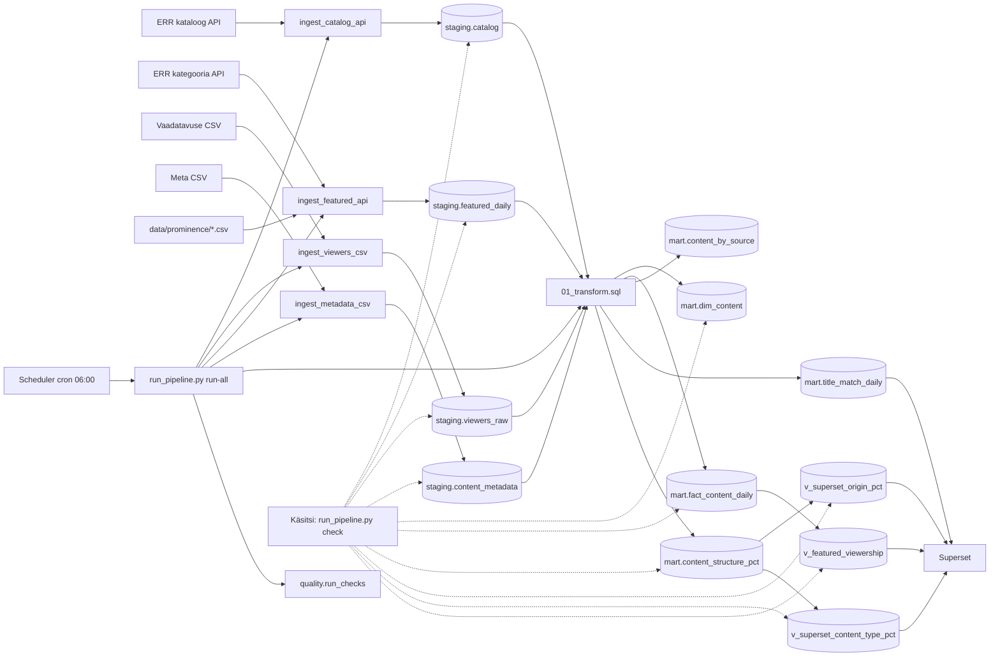

# Arhitektuur

Jupiteri (ERR) sisu andmeanalüüsi projekt. Andmed liiguvad ERR API-st ja CSV-failidest PostgreSQL-i, transformeeritakse `mart` kihti ning visualiseeritakse Supersetis.

## Äriküsimus

1. Kuidas erinevad Jupiteri **kataloogis olemasoleva** sisu, **kasutajaliideses esiletõstetud** sisu ja **vaadatud** sisu struktuurid **sisutüüpide** ja **päritolumaad** lõikes?
2. Kui tugev on **esiletõstetuse** ja **vaadatavuse** vaheline seos?

Küsimuse 1 vastus on kaks **100% virnlintdiagrammi** (horisontaalne virn, telg 0–100%), kus võrreldakse kolme “struktuuri” read:

| Rida diagrammil | Andmestik (pärast transformi) | Sisendallikad |
|-----------------|------------------------------|---------------|
| **Kataloogi struktuur** | `mart.content_structure_pct` (`structure_type = catalog`) | `staging.catalog` + `staging.content_metadata` |
| **Esitatud sisu struktuur** | sama (`presented`) | `staging.featured_daily` + meta |
| **Vaadatud sisu struktuur** | sama (`viewed`) | `staging.viewers_raw` (päevane) + meta |

Küsimuse 1 täisdiagrammid eeldavad metaandmete CSV-d (`data/metadata/jupiter_metadata.csv` → `staging.content_metadata`). **Ilma meta laadimiseta** jääb alles vaheversioon (nt kataloogi API kategooria või vaadatavuse toor-`content_type`), mis ei vasta allikdiagrammidele.

Esitatud sisu struktuuri hindamiseks on eelnevalt vaja arvutada sisunimetuste päevased esiletõstetuse skoorid, mida saab kasutada ka eraldiseisva mõõdikuna. 
Iga sisunimetuse paigutus Jupiteri platvormil annab sisule teatud arvu punkte sõltuvalt sisu asukohast lehel (rida+positsioon reas) ning konkreetse lehe (esileht, sarjad, filmid, saated) nähtavuse kaalust. Lõplik skoor saadakse kõigi nende kaalutud punktide summana. Mida nähtavamatel lehtedel ja asukohtadel sisu paikneb, seda kõrgem on selle päevane esiletõstetuse skoor.

### Äriküsimus 1 — mõõdikud (näidikulaud)

#### Mõõdik 1A: Päritolumaad (`Päritolumaad`)

Üks diagramm, kolm rida, 100% virn. Kategooriad (metaandmetest), näiteks:

- Eesti (Estonia)
- Euroopa Liit (European Union)
- Ühendkuningriik (United Kingdom)
- Ülejäänud maailm (Rest of the world)
- Kaastootmine (Coproduction)
- Põhjamaad (Nordic countries)
- USA ja Kanada (USA and Canada)

**Arvutus iga rea kohta:**

| Rida | Arvutusloogika (`mart.content_structure_pct`) |
|------|----------------|
| Kataloog | `COUNT` meta-ühendatud pealkirju kataloogis → protsent (100%) |
| Esitatud | `SUM(prominence_score_total)` viimasel esiletõstmise päeval, meta-ühendatud pealkirjad → protsent (100%) |
| Vaadatud | `SUM` päevasest vaadatavuse CSV-st (`viewers_raw.total`, `grain = daily`) samal `activity_date` → protsent (100%) |

Kõik kolm rida arvutatakse **ühe** `activity_date` kohta (viimane `staging.featured_daily.feature_date`). Ainult pealkirjad, millel on meta (`staging.content_metadata`). Nii nähtub nihe kataloogi (pealkirjade arv), esiletõstetuse (skooride summa) ja vaatamise (vaatamiste summa) vahel — nt väikese katalogiosaga sisu võib saada suurema skoori või vaatamiste osa.

#### Mõõdik 1B: Sisutüübid (`Sisutüübid`)

Teine diagramm, sama kolme rea loogika. Kategooriad (metaandmetest), näiteks:

- Filmid ja näidendid (Films and plays)
- Kultuur (Culture)
- Elu (Life)
- Info (Informative)
- Muusika (Music)
- Meelelahutus (Entertainment)
- Sarjad (Scripted series)
- Sport (Sport)
- Infotainment
- Uudised (News)

Arvutus on sama mis päritolumaa puhul: kataloog **pealkirjade arvu** järgi, esitatud ja vaadatud **nähtavuse skoori ja vaatamiste summa** järgi.

#### Visuaalne võrdlus (ärianalüüs)

Diagrammid peaksid võimaldama näha **nihet** kataloogi, esiletõstetuse ja vaatamise vahel, nt:

- Eesti sisu suur osa kataloogist, kesmine nähtavuses, väiksem osa vaatamistest.
- UK või sarjad: väiksem kataloogiosakaal, suurem nähtavuses, suurem vaatamiste osakaal.

Supersetis: horisontaalne **100% stacked bar chart**, mõõt `SUM(pct)`, dimensioonid `structure_label` + `segment` (andmestikud `mart.v_superset_origin_pct`, `mart.v_superset_content_type_pct`).

### Äriküsimus 2 — mõõdikud

#### Mõõdik 2: Sisu esiletõstetuse ja vaadatavuse vaheline seos

Võrdlus **pealkirjade kaupa**: esiletõstmise skoor (`prominence_score_total`) ja vaatamised (`views_total`).

- **Andmestik:** `mart.v_featured_viewership` (viimase esiletõstmise päev).
- **Dashboard:** tabel; scatter/bubble on valikuline Supersetis (vt `docs/superset.md`).
- Toru **ei arvuta** automaatselt Pearsoni korrelatsioonikordajat — seda saab teha analüütiku tööriistaga või Superseti chart tüübiga, kui sama päeva andmed on olemas.
- Kui sama päeva viewers CSV puudub, võib `views_total` tulla viimasest olemasolevast päevast sama pealkirja kohta (`COALESCE` transformis).

## Andmeallikad

| Allikas | Tüüp | Ajas muutuv? | Roll |
|---------|------|--------------|------|
| ERR videokataloog | HTTP API | Jah, iga päev | Kataloogi koosseis (`catalog_id`, pealkiri, kategooria) |
| Jupiteri kategoorialehed (esiletõstmine) | HTTP API + konfig CSV | Jah, iga päev | Esiletõstmise skoor (`data/prominence/*.csv`) |
| Vaadatavus | CSV (`data/viewers/`) | Jah, iga päev | Päevafail `jupiter_d_*.csv` → mart; nädalafail `jupiter_w_*.csv` laetakse stagingusse, kuid transform kasutab ainult `grain = daily` |
| Sisu metaandmed | CSV (`data/metadata/jupiter_metadata.csv`) | ~nädalas | **Sisutüüp** ja **päritolumaa** pealkirja kohta (küsimus 1 diagrammid) |

**Ühendusvõti** kõigi allikate vahel on **pealkiri** (`heading` kataloogis, `title` vaadatavuses ja esiletõstmises). Transform kasutab funktsiooni `mart.normalize_title()` (trim, üleliigsed tühikud).

## Andmevoog

Esmasel käivitusel loob PostgreSQL skeemi `init/01` … `init/10` (Superseti vaated failis `10`, pärast `08`). Dashboard imporditakse konteineriga `superset-import` (vt `compose.yml`, `docs/superset.md`).

Iga ingest kirjutab käivituse logi tabelisse `staging.pipeline_runs` (`run_id`, `source_name`, `status`).

## Andmebaasi kihid

| Kiht | Roll |
|------|------|
| `staging` | Toorandmed allikatest, võimalikult lähedal API/CSV kujule. |
| `mart` | Ühendatud ja äriloogikaga tabelid analüüsiks. |
| `quality` | Andmekvaliteedi kontrollid: `quality.check_runs`, `quality.rule_results`, vaade `quality.v_latest_rule_results`; käivitus `quality.run_checks()` või `run_pipeline.py quality`. |

### Olulisemad staging tabelid

| Tabel | Kirjeldus |
|-------|-----------|
| `staging.catalog` | Üks rida `catalog_id` kohta; uued read ja pealkirja muutused (ingest kasutab seda, mitte `catalog_raw`) |
| `staging.catalog_title_changes` | Logi, kui sama `catalog_id` pealkiri muutub |
| `staging.featured_daily` | Päevane snapshot: pealkiri + esiletõstmise skoor |
| `staging.viewers_raw` | Vaadatavus (`grain`: `daily` või `weekly`); **mart** kasutab transformis ainult `daily` |
| `staging.content_metadata` | Meta CSV snapshot: pealkiri, `origin_code`, `content_type_code` |
| `staging.pipeline_runs` | Toru käivituste ajalugu |

### Olulisemad mart tabelid ja vaated

| Tabel / vaade | Kirjeldus |
|---------------|-----------|
| `mart.dim_content` | Unikaalsed pealkirjad; lipud (`in_catalog`, `in_featured`, `in_viewers_daily`, `in_metadata`); meta sildid `origin_country`, `meta_content_type` |
| `mart.fact_content_daily` | Päevane ühendus esiletõstmine + vaadatavus + kataloogi kategooria |
| `mart.content_by_source` | Pealkirjade arv allika lõikes (vaheversioon; kataloogil `activity_date = CURRENT_DATE`) |
| `mart.title_match_daily` | Päevane ühenduste kvaliteet (`catalog_match_pct`, `viewers_match_pct`, …) |
| `mart.content_structure_pct` | Struktuuri %: `catalog` (COUNT) / `presented` (SUM skoor) / `viewed` (SUM vaated) × `origin_country` või `content_type`; viimane featured päev |
| `mart.v_featured_viewership` | Viimase esiletõstmise päeva read (skoor; vaated eelistatult samal päeval) |
| `mart.v_superset_origin_pct` | Superset: päritolumaa 100% virn |
| `mart.v_superset_content_type_pct` | Superset: sisutüüpide 100% virn |
| `mart.v_superset_structure_pct` | Superset: struktuur ilma meta (fallback) |
| `mart.v_superset_featured_top` | Superset: TOP esiletõstetud (viimane päev) |
| `mart.v_content_latest_day` | Abivaade: `fact_content_daily` viimase featured päeva kohta |

Tabel `mart.content_structure_pct` täidetakse transformiga: üks rida = `(structure_type, dimension, category_code, category_label, measure_value, pct)`. Meta CSV koodid (`EST`, `FILM`, …) tõlgitakse eestikeelseteks siltideks tabelites `mart.ref_origin_labels` ja `mart.ref_content_type_labels`.

Transform kustutab mart tabelid ja täidab need uuesti (`scripts/01_transform.sql`). Staging säilitab ajaloo (sh vanemad vaadatavuse laadimised erinevate `run_id`-dega).

## Automatiseerimine

| Komponent | Kirjeldus |
|-----------|-----------|
| `scheduler` konteiner | Cron, ajavöönd `Europe/Tallinn` |
| `scheduler/crontab` | Iga päev kell **06:00** → `python scripts/run_pipeline.py run-all` (sh transform ja `quality.run_checks`) |
| `run_pipeline.py check` | Read-only kontroll (failid + staging/mart + Superseti vaated). Exit 0, kui on ainult WARN-id; `--strict` loeb WARN-id veaks. |
| `logs/pipeline.log` | Scheduleri standardväljund |

Enne cron'i peab uus vaadatavuse päevafail (`jupiter_d_YYYYMMDD-YYYYMMDD.csv`) olema kaustas `data/viewers/`, et esiletõstmise ja vaadatavuse päevad kattuksid.

Kui päevad ei kattu, annab `check` sellest hoiatuse (nt featured päev on uuem kui viewers CSV). Sel juhul võib `views_total` tulla viimase saadaval oleva viewers päeva pealt sama pealkirja kohta (fallback), mistõttu sama päeva võrdlus ei ole enam puhas.

## Tööjaotus

| Roll | Vastutus | Täitja |
|------|----------|--------|
| Andmeallika omanik | Kirjutab sissevõtu loogika, hoiab API-t töös | Raul Lobanov |
| Transformatsioonide omanik | Kirjutab mart kihi mudelid ja mõõdikute arvutuse | Tarvo Nõulik |
| Kvaliteedi omanik | Kirjutab testid ja vaatab läbi ebaõnnestunud kontrollid | Margus Valdre |
| Näidikulaua omanik | Ehitab näidikulaua ja seob selle äriküsimusega | Anu Aus |

## Riskid

| Risk | Mõju | Maandus |
|------|------|---------|
| Puuduv sisunimetus metaandmetes  | Pealkiri ei lähe `content_structure_pct` arvutusse (INNER JOIN meta). | Täita meta CSV; hinnata osakaalu; vajadusel käsitsi täiendus |
| Liiga lühike analüüsiperiood  | Lühike periood võib moonutada tulemust - ühekordne suur "sündmus" | Vältida põhjuslike järelduste tegemist, analüüsi kordamine pikema perioodi jooksul tulevikus |
| Unikaalse identifikaatori puudumine  | Andmete sidumine toimub pealkirjade järgi, mis võivad allikati erineda  | Lisada andmevoogu andmekvaliteedi kontrollid |

## Privaatsus ja turve

Projekt kasutab ainult avalikke andmeid. Isikuandmeid ei koguta.

Andmebaasi kasutajanimi ja parool tulevad `.env` failist. `.env` faili ei tohi reposse lisada.
