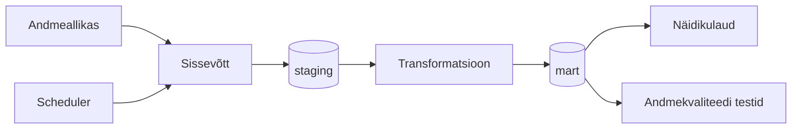

# Arhitektuur
>[!WARNING]
**Juhend:** See fail on projektitöö esimese nädala väljund. Asenda kõik nurksulgudes plankid oma projekti tegeliku sisuga. Kustuta see juhendrida.

## Äriküsimus

[Kirjuta ühe-kahe lausega oma äriküsimus täpselt. Näiteks: "Millistes kauplustes ja mis kellaaegadel on müügitõhusus (käive külastaja kohta) kõrgeim?"]
1. Kuidas erinevad Jupiteri kataloogis olemasoleva sisu, kasutajaliideses esiletõstetud sisu ja vaadatud sisu struktuurid žanrite ja päritolumaade lõikes?
2. Kui tugev on esiletõstetuse ja vaadatavuse vaheline seos?

## Mõõdikud

1. Žanrite ja päritolumaade osatähtsused (%) erinevates kihtides (kataloog, esiletõstetus, vaadatavus). Osatähtsus % = vastava žanri/päritolumaa nimetuste arv (kihis) jagatud koguarvuga * 100% . Valemit rakendatakse kõikidele kihtidele eraldi. Kihtide tulemusi võrreldakse omavahel.
2. Sisunimetuste esiletõstetuse skoorid
3. Korrelatsioonid esiletõstetuse ja vaadatavuse vahel

## Andmeallikad

| Allikas | Tüüp | Ajas muutuv? | Roll |
|---------|------|--------------|------|
| [Nimi] | [API / CSV / DB] | Jah, [iga X tundi / päeva] | [Milleks kasutatakse?] |
| Kataloogi sisu | API | Jah, iga päev | Kataloogi koosesisu pärimiseks |
| Esiletõstetud sisu | API | Jah, iga päev | Sisunimetuste esiletõstetuse arvutamiseks |
| Vaadatavuse andmed | CSV | Jah, iga päev | Sisunimetuste vaadatavuse pärimiseks |
| Sisu kirjeldavad metaandmed | CSV | Jah, iga nädal | Sisunimetuste žanrite, päritolumaade ja tootmisaastate pärimiseks |

## Andmevoog

> Täpsusta diagrammi vastavalt oma projektile — lisa rohkem andmeallikaid, mudeleid või teenuseid.

## Andmebaasi kihid

| Kiht | Roll |
|------|------|
| `staging` | Hoiab allika andmeid töötlemata kujul. |
| `mart` | Hoiab transformeeritud ja ärilogikat sisaldavaid tabeleid. |

## Tööjaotus

| Roll | Vastutus | Täitja |
|------|----------|--------|
| Andmeallika omanik | Kirjutab sissevõtu loogika, hoiab API-t töös | [Nimi] |
| Transformatsioonide omanik | Kirjutab mart kihi mudelid ja mõõdikute arvutuse | [Nimi] |
| Kvaliteedi omanik | Kirjutab testid ja vaatab läbi ebaõnnestunud kontrollid | [Nimi] |
| Näidikulaua omanik | Ehitab näidikulaua ja seob selle äriküsimusega | [Nimi] |

## Riskid

| Risk | Mõju | Maandus |
|------|------|---------|
| [Risk 1 — näiteks: API ei vasta] | [Mis juhtub?] | [Kuidas maandad?] |
| [Risk 2 - sisnimetused erinevates kihtides ei ole vastavuses] | Sisunimetus on olemas kataloogis, kuid ei saa esletõstetuse ja/või vaadatavuse näitajaid. Sisu on vaadataud, aga sama nimetus ei esine kataloogis. Jne | [Kuidas maandad?] |
| Puuduv sisunimetus metaandmetes  | Sisunimetus ei saa endale külge žanri ja/või päritolumaad. | [Kuidas maandad?] |

## Privaatsus ja turve

Projekt kasutab ainult avalikke andmeid. Isikuandmeid ei koguta. [Andmebaasi paroolid peavad tulema `.env` failist.]Andmebaasi kasutajanimi ja parool tulevad .env failist. .env faili ei tohi reposse lisada.
